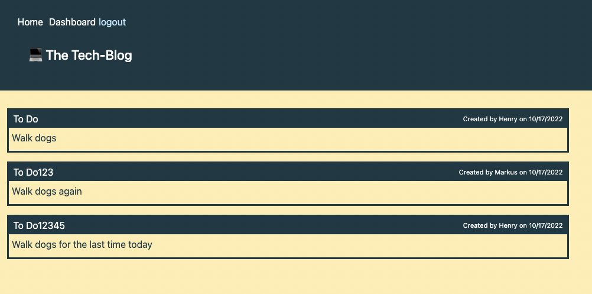
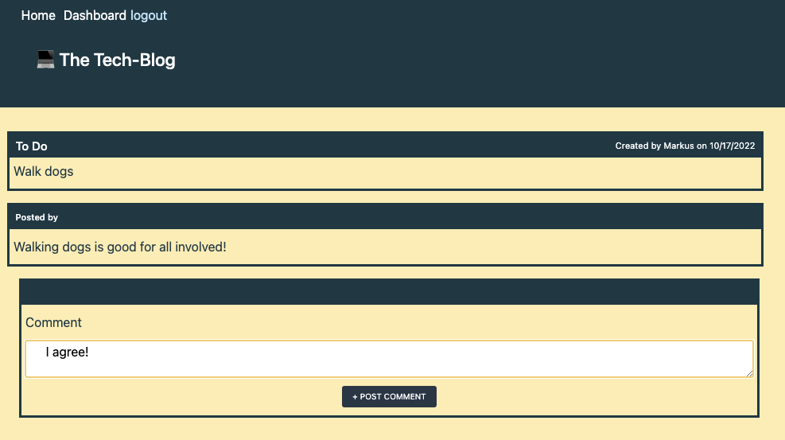
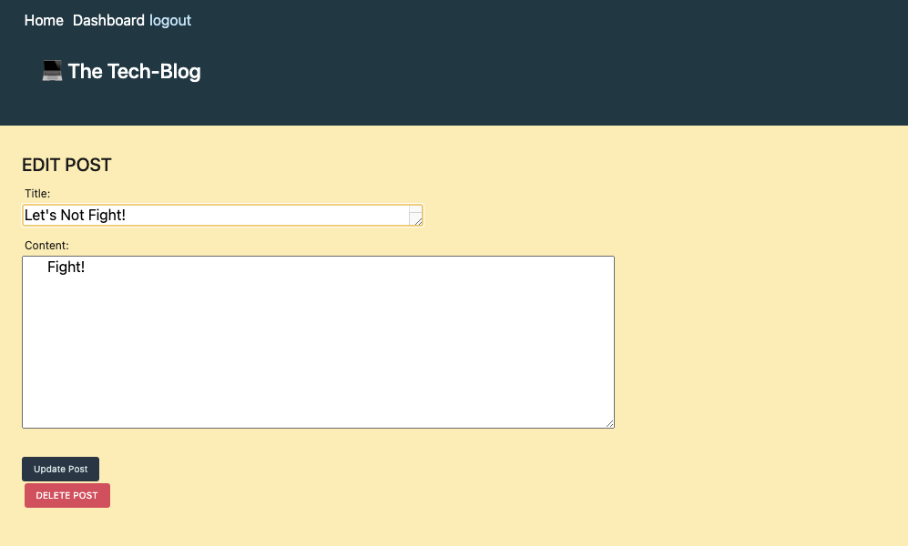
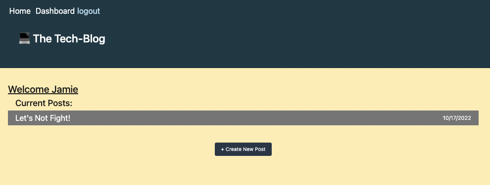

# TECH-BLOG

## APP DEPLOYMENT LINK

[The Tech-Blog](https://fast-atoll-41188.herokuapp.com/)

## Description

As anyone who has read online technical documentation can tell you, keeping up with your written communication skills is an essential part of becoming a successful web developer. Blogs are not only an excellent way to stay in practice, but offer a forum to discuss ideas with other developers and to keep up on the latest vernacular, syntax and coding developments.  

This CMS-style blog-site provides that opportunity with its ability to publish your articles, blogsposts, thoughts and opinions.

## Usage

At the homepage, click on LOGIN and enter your name and password. 
  

If this is your first time using the site, click on SIGN UP INTEAD and fill out the fields on that page.  
  

Once signed in, you may navigate back to the homepage to read and comment on other posts, and you can now see the option to <i> logout </i>  
  

  

If you click on DASHBOARD, you'll be taken to your personal dashboard where you can create, edit, and delete your posts. Here, the option to create a new post is shown:
  

Here, the Title and Content fields can be filled in and posted to their dashboard and the homepage:
  

And there is the option to Update or Delete the post, as well:
  

Once updated (or deleted), you will be directed back to your dashboard and can see all of your posts:
  
 

## License

This project is covered under the [MIT License](https://opensource.org/licenses/MIT).

## Questions

GitHub profile: https://github.com/LujanSolo

Contact me at lujansolo@proton.me for additional inquiries.
